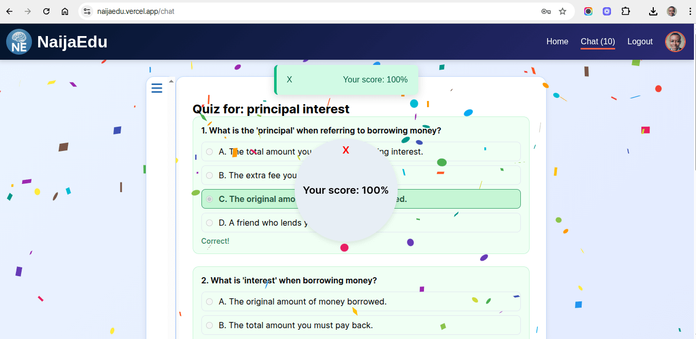

# 🎓 naijaEdu Frontend

This is the frontend of **naijaEdu**, an AI-powered learning platform that explains academic topics, reads them out loud, and generates quizzes — all in an engaging chat interface tailored for Nigerian students.

---

## 📸 Preview


*Homepage UI*


*Chatpage UI – chat interface with AI responses*


*Chatpage with AI generated contents*


*Auto-generated quiz with confetti celebration*

---

## 🌐 Live Site

🔗 [https://naijaedu.vercel.app](https://naijaedu.vercel.app)

---

## 🚀 Features

* 🔐 Google & Email Authentication
* 💬 Chat-style interface for entering topics
* 📘 AI-generated explanations from Gemini
* 🔊 Text-to-speech playback (TTS)
* 🧪 Quiz generator based on topic input
* 🎉 Confetti animation for completed quizzes
* 📤 **Share explanations to social media**
* 🌙 Responsive design (mobile-first)

---

## 🧰 Tech Stack

* **React** + **TypeScript**
* **CSS**
* **Axios**
* **Framer Motion**
* **React Markdown**
* **Text-to-Speech API**

---

## 🛠️ Getting Started

### 1. Clone the Repository

```bash
git clone https://github.com/talk2dennis/naijaEdu.git
cd naijaEdu/frontend
```

### 2. Install Dependencies

```bash
npm install
```

### 3. Environment Variables

Create a `.env` file in the root:

```env
VITE_API_BASE_URL=https://naijaedu.onrender.com
VITE_GOOGLE_CLIENT_ID=uour-google-client-id
```

### 4. Run the App

```bash
npm run dev
```

---

## 🔒 Authentication

Authentication:

* Google sign-in
* Email/password registration

Users receive a JWT which is used in API requests.

---

## 🤖 How It Works

1. Type a topic like `"photosynthesis"`
2. The backend fetches a simplified explanation using Google Gemini
3. You can listen to it using the speaker icon
4. Click “Generate Quiz” to test your knowledge
5. Share the explanation on social media
6. If you score 70 or above on the quiz, a confetti animation celebrates your achievement!

---

## 📂 Folder Structure

```
src/
│
├── components/         # Reusable UI components
├── pages/              # ChatPage, LoginPage, etc.
├── contexts/           # Auth and global state
├── api/                # Axios client config
├── types/              # TypeScript types
└── assets/             # Icons and images
```

---

## 🧠 Ideal For

* Students in Nigeria (basic primary, JSS/SSS, WAEC/NECO)
* Teachers and education support apps
* Personal learning projects

---

## 📄 License

MIT License © 2025 [Dennis Adigwe](https://github.com/talk2dennis)  
Connect on [LinkedIn](https://www.linkedin.com/in/talk2dennis)
